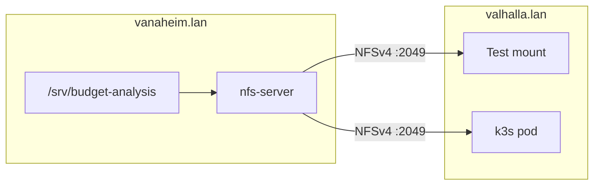

# NFS Setup — Vanaheim → Valhalla (Budget Analysis)

This guide walks through setting up **NFSv4** on **vanaheim.lan** (Rocky Linux 10) so **valhalla.lan** — and pods in its k3s cluster — can store Budget Analysis user documents at `/srv/budget-analysis`.

When you are done, you will have:

1. An NFS export on Vanaheim, restricted to Valhalla's IP
2. A successful read/write test from the Valhalla host
3. A successful read/write test from a pod inside Kubernetes

**Related docs:** [deployment.md](deployment.md) (app deploy). GCS → NFS data migration is a follow-up.

---

## Summary

| Item | Value |
|------|-------|
| **NFS server** | `vanaheim.lan` (Rocky Linux 10) |
| **NFS client** | `valhalla.lan` (k3s host) |
| **Export path** | `/srv/budget-analysis` |
| **App mount path (later)** | `/data` inside the Streamlit pod |
| **NFS version** | v4 (port 2049 only) |
| **Access** | Valhalla IP only — not exposed to the internet |



---

## Prerequisites

- SSH access to **vanaheim.lan** and **valhalla.lan** with `sudo`
- Hostnames resolve on both machines (`ping vanaheim.lan`, `ping valhalla.lan`)
- k3s running on Valhalla; `kubectl` works from Valhalla
- The `budget-analysis` namespace exists (or you will create it during the k8s test)

**Collect these values before you start** (run on each host):

```bash
# On valhalla.lan — you will allow this IP in the NFS export
hostname -I | awk '{print $1}'

# On vanaheim.lan — confirm the storage path will live here
hostname -f
df -h /
```

In the commands below, replace:

| Placeholder | Example | Your value |
|-------------|---------|------------|
| `<VALHALLA_IP>` | `192.168.1.10` | Valhalla's LAN IP |
| `<VANAHEIM_IP>` | `192.168.1.20` | Vanaheim's LAN IP (for reference) |

---

## Phase 1 — Prepare storage on Vanaheim

SSH to **vanaheim.lan**.

### 1.1 Create the export directory

```bash
sudo mkdir -p /srv/budget-analysis
```

### 1.2 Choose ownership (pick one approach)

**Option A — Simple start (recommended for initial setup)**

The container often runs as root; `no_root_squash` (configured later) lets root in the pod write files owned by root on the share.

```bash
sudo chown root:root /srv/budget-analysis
sudo chmod 755 /srv/budget-analysis
```

**Option B — Dedicated UID (tighter, more setup)**

Create a matching user on Vanaheim and Valhalla with the same UID (e.g. `1001`), then `chown` the directory to that user. Use `root_squash` in exports instead of `no_root_squash`, and run the app container as that UID. Use Option A first; switch later if you want.

### 1.3 SELinux (Rocky Linux)

Rocky Linux has SELinux enabled by default. Allow NFS read/write exports:

```bash
sudo setsebool -P nfs_export_all_rw 1
```

If writes still fail with "Permission denied", label the directory:

```bash
sudo semanage fcontext -a -t public_content_rw_t "/srv/budget-analysis(/.*)?"
sudo restorecon -Rv /srv/budget-analysis
```

(`policycoreutils-python-utils` provides `semanage`; install with `sudo dnf install -y policycoreutils-python-utils` if missing.)

---

## Phase 2 — Install and configure NFS on Vanaheim

Still on **vanaheim.lan**.

### 2.1 Install packages

```bash
sudo dnf install -y nfs-utils
```

### 2.2 Prefer NFSv4

Edit `/etc/nfs.conf` and ensure NFSv4 is enabled. Under `[nfsd]`, set:

```ini
[nfsd]
vers2=n
vers3=n
vers4=y
vers4.0=y
vers4.1=y
vers4.2=y
```

You can view the current effective settings with:

```bash
grep -E '^vers' /etc/nfs.conf || true
```

### 2.3 Configure the export

Edit `/etc/exports` and add **one line** (replace `<VALHALLA_IP>`):

```
/srv/budget-analysis  <VALHALLA_IP>(rw,sync,no_subtree_check,no_root_squash,sec=sys)
```

| Flag | Purpose |
|------|---------|
| `rw` | Read/write for the client |
| `sync` | Flush writes to disk before replying (safer for data) |
| `no_subtree_check` | Standard for single-directory exports |
| `no_root_squash` | Remote root (container root) can write as root — needed with default Python images |
| `sec=sys` | Standard UNIX auth (no Kerberos) |

**Important:** Export only this directory — never export `/` or `/home`.

Apply exports:

```bash
sudo exportfs -rav
sudo exportfs -v
```

Expected output includes a line like:

```
/srv/budget-analysis
    <VALHALLA_IP>(sync,wdelay,hide,no_subtree_check,sec=sys,rw,secure,root_squash,no_all_squash)
```

Note: `exportfs -v` may display `root_squash` in the parsed flags even when you set `no_root_squash` — verify your `/etc/exports` line is correct. If pod writes fail with permission errors, revisit Phase 1.2 and the export flags.

### 2.4 Firewall (firewalld)

Restrict NFS to Valhalla only. NFSv4 uses **TCP port 2049**.

```bash
# Optional: remove broad NFS access if it was opened before
# sudo firewall-cmd --permanent --remove-service=nfs

sudo firewall-cmd --permanent --add-rich-rule='rule family="ipv4" source address="<VALHALLA_IP>/32" port port="2049" protocol="tcp" accept'
sudo firewall-cmd --permanent --add-rich-rule='rule family="ipv4" source address="<VALHALLA_IP>/32" port port="111" protocol="tcp" accept'
sudo firewall-cmd --reload
sudo firewall-cmd --list-all
```

Port `111` (rpcbind) is sometimes still required depending on client behavior; allowing it from Valhalla only is fine.

### 2.5 Enable and start services

```bash
sudo systemctl enable --now nfs-server
sudo systemctl status nfs-server --no-pager
```

Verify the server is listening:

```bash
sudo ss -tlnp | grep 2049
```

---

## Phase 3 — Test NFS from the Valhalla host

SSH to **valhalla.lan**.

### 3.1 Install NFS client tools

```bash
sudo dnf install -y nfs-utils
```

### 3.2 Confirm the export is visible

```bash
showmount -e vanaheim.lan
```

Expected:

```
Export list for vanaheim.lan:
/srv/budget-analysis <VALHALLA_IP>
```

If `showmount` fails:

- Ping: `ping -c 3 vanaheim.lan`
- Check Vanaheim firewall and that `nfs-server` is running
- Confirm `<VALHALLA_IP>` in `/etc/exports` matches `hostname -I` on Valhalla

### 3.3 Manual mount test

```bash
sudo mkdir -p /mnt/budget-analysis-test
sudo mount -t nfs4 -o vers=4.1,proto=tcp vanaheim.lan:/srv/budget-analysis /mnt/budget-analysis-test
```

Check:

```bash
mount | grep budget-analysis
df -h /mnt/budget-analysis-test
```

### 3.4 Read/write test

```bash
echo "nfs-host-test-$(date -Iseconds)" | sudo tee /mnt/budget-analysis-test/host-test.txt
cat /mnt/budget-analysis-test/host-test.txt
ls -la /mnt/budget-analysis-test/
```

On **vanaheim.lan**, confirm the file exists:

```bash
ls -la /srv/budget-analysis/
cat /srv/budget-analysis/host-test.txt
```

### 3.5 Clean up host test mount

```bash
sudo umount /mnt/budget-analysis-test
sudo rmdir /mnt/budget-analysis-test
```

Optional — remove the test file on Vanaheim:

```bash
sudo rm /srv/budget-analysis/host-test.txt
```

---

## Phase 4 — Test NFS from inside Kubernetes

These steps use a **temporary test pod** with an inline NFS volume. They do not modify the Budget Analysis Deployment yet.

Run all commands on **valhalla.lan**.

### 4.1 Ensure the namespace exists

```bash
kubectl apply -f - <<'EOF'
apiVersion: v1
kind: Namespace
metadata:
  name: budget-analysis
EOF
```

(If you already deployed the app, this is a no-op.)

### 4.2 Run a test pod

```bash
kubectl apply -f - <<'EOF'
apiVersion: v1
kind: Pod
metadata:
  name: nfs-test
  namespace: budget-analysis
spec:
  restartPolicy: Never
  containers:
    - name: test
      image: busybox:1.36
      command:
        - sh
        - -c
        - |
          echo "nfs-k8s-test-$(date -Iseconds)" > /data/k8s-test.txt
          echo "--- wrote ---"
          cat /data/k8s-test.txt
          ls -la /data/
          sleep 3600
      volumeMounts:
        - name: nfs-vol
          mountPath: /data
  volumes:
    - name: nfs-vol
      nfs:
        server: vanaheim.lan
        path: /srv/budget-analysis
EOF
```

### 4.3 Wait for the pod and check logs

```bash
kubectl -n budget-analysis wait --for=condition=Ready pod/nfs-test --timeout=60s
kubectl -n budget-analysis logs nfs-test
```

Expected log output includes your `nfs-k8s-test-...` line and a directory listing with `k8s-test.txt`.

Pod status:

```bash
kubectl -n budget-analysis get pod nfs-test
```

### 4.4 Verify on Vanaheim

On **vanaheim.lan**:

```bash
ls -la /srv/budget-analysis/
cat /srv/budget-analysis/k8s-test.txt
```

You should see both any earlier host test file (if you kept it) and `k8s-test.txt`.

### 4.5 Optional — test via PersistentVolume (production-like)

This mirrors how the app will eventually mount storage.

**Create PV and PVC:**

```bash
kubectl apply -f - <<EOF
apiVersion: v1
kind: PersistentVolume
metadata:
  name: budget-analysis-data-pv
spec:
  capacity:
    storage: 10Gi
  accessModes:
    - ReadWriteMany
  persistentVolumeReclaimPolicy: Retain
  storageClassName: budget-analysis-nfs
  nfs:
    server: vanaheim.lan
    path: /srv/budget-analysis
---
apiVersion: v1
kind: PersistentVolumeClaim
metadata:
  name: budget-analysis-data
  namespace: budget-analysis
spec:
  accessModes:
    - ReadWriteMany
  storageClassName: budget-analysis-nfs
  resources:
    requests:
      storage: 10Gi
  volumeName: budget-analysis-data-pv
EOF
```

**Check binding:**

```bash
kubectl get pv budget-analysis-data-pv
kubectl -n budget-analysis get pvc budget-analysis-data
```

Status should be `Bound`.

**Test pod using the PVC:**

```bash
kubectl apply -f - <<'EOF'
apiVersion: v1
kind: Pod
metadata:
  name: nfs-pvc-test
  namespace: budget-analysis
spec:
  restartPolicy: Never
  containers:
    - name: test
      image: busybox:1.36
      command:
        - sh
        - -c
        - |
          echo "nfs-pvc-test-$(date -Iseconds)" > /data/pvc-test.txt
          cat /data/pvc-test.txt
          sleep 3600
      volumeMounts:
        - name: data
          mountPath: /data
  volumes:
    - name: data
      persistentVolumeClaim:
        claimName: budget-analysis-data
EOF
```

```bash
kubectl -n budget-analysis wait --for=condition=Ready pod/nfs-pvc-test --timeout=60s
kubectl -n budget-analysis logs nfs-pvc-test
```

Confirm on Vanaheim: `cat /srv/budget-analysis/pvc-test.txt`

### 4.6 Clean up test resources

When everything works, remove test pods (keep PV/PVC if you are about to wire them into the real Deployment):

```bash
kubectl -n budget-analysis delete pod nfs-test nfs-pvc-test --ignore-not-found
```

Remove test files on Vanaheim if you like:

```bash
sudo rm -f /srv/budget-analysis/host-test.txt \
             /srv/budget-analysis/k8s-test.txt \
             /srv/budget-analysis/pvc-test.txt
```

---

## Phase 5 — App integration (code + k8s)

NFS infra is ready. App integration (filesystem storage + PV/PVC mount) is in the repo:

1. `k8s/pv.yaml` and `k8s/pvc.yaml` — NFS share as `budget-analysis-data`
2. PVC mounted at `/data` in `k8s/deployment.yaml`
3. `storage_utils.py` — filesystem backend (replaces `gcs_utils.py`)

**Still follow-up (separate from code):** migrate existing GCS blobs into `/srv/budget-analysis/{username}/...`. Until that copy runs, the share may be empty aside from newly seeded users.

See [deployment.md](deployment.md) for apply/verify steps.

---

## Troubleshooting

### `showmount -e vanaheim.lan` — RPC failed / timed out

| Check | Command |
|-------|---------|
| Vanaheim NFS running | `sudo systemctl status nfs-server` (on Vanaheim) |
| Firewall | `sudo firewall-cmd --list-all` (on Vanaheim) |
| Reachability | `ping vanaheim.lan` (on Valhalla) |
| Port 2049 open | `nc -zv vanaheim.lan 2049` (on Valhalla) |

### Mount fails — `access denied` or `Permission denied`

- Confirm `<VALHALLA_IP>` in `/etc/exports` matches Valhalla's actual IP (`hostname -I`)
- Re-run `sudo exportfs -rav` on Vanaheim
- Check SELinux: `sudo setsebool -P nfs_export_all_rw 1`
- Try `no_root_squash` in `/etc/exports` if the client is a root container

### Pod stuck `ContainerCreating` — mount failure

```bash
kubectl -n budget-analysis describe pod nfs-test
```

Look for events like `FailedMount`. Common causes:

- `vanaheim.lan` does not resolve inside the cluster — use CoreDNS or add a host alias; as a quick test, use `<VANAHEIM_IP>` instead of the hostname in the pod spec
- Vanaheim firewall blocking the **node** IP (must be Valhalla's IP, not pod CIDR)
- Wrong export path — must be `/srv/budget-analysis`

**DNS test from a cluster pod:**

```bash
kubectl run -it --rm dns-test --image=busybox:1.36 --restart=Never -- nslookup vanaheim.lan
```

If DNS fails, either fix LAN DNS or set `server: <VANAHEIM_IP>` in the NFS volume spec (acceptable on a stable homelab).

### Pod writes work but files have wrong ownership

Harmless for the app if only the Streamlit container accesses the share. For tidier permissions, move to Option B in Phase 1.2 (dedicated UID + `root_squash`).

### `ReadWriteMany` PVC stays Pending

- PV `storageClassName` must match PVC (`budget-analysis-nfs`)
- PV `capacity` must be ≥ PVC request
- `volumeName` on the PVC must match the PV name exactly

---

## Security reminders

- Export is **LAN-only** — do not port-forward NFS through Cloudflare or expose port 2049 to the internet
- Allow **only Valhalla's IP** in `/etc/exports` and firewalld
- User file isolation (`alice/` vs `bob/`) is enforced by the **app**, not NFS — same model as the old GCS bucket
- Back up `/srv/budget-analysis` regularly (e.g. `restic`, `rsync`)

---

## Completion checklist

- [ ] `/srv/budget-analysis` exists on Vanaheim with correct permissions and SELinux context
- [ ] `nfs-server` enabled and running on Vanaheim
- [ ] `/etc/exports` allows only `<VALHALLA_IP>`
- [ ] Firewalld allows NFS from Valhalla only
- [ ] `showmount -e vanaheim.lan` works from Valhalla
- [ ] Manual mount + write + read works on Valhalla host
- [ ] `nfs-test` pod writes `k8s-test.txt` visible on Vanaheim
- [ ] *(Optional)* PV/PVC bound and `nfs-pvc-test` pod succeeds
- [ ] Test pods and temp files cleaned up

---

## See also

- [deployment.md](deployment.md) — Budget Analysis homelab deploy
- [Valhalla Self-Hosting.md](https://github.com/mschmidlin1/ValhallaLandingPage/blob/main/docs/Self-Hosting.md) — k3s and runner setup
