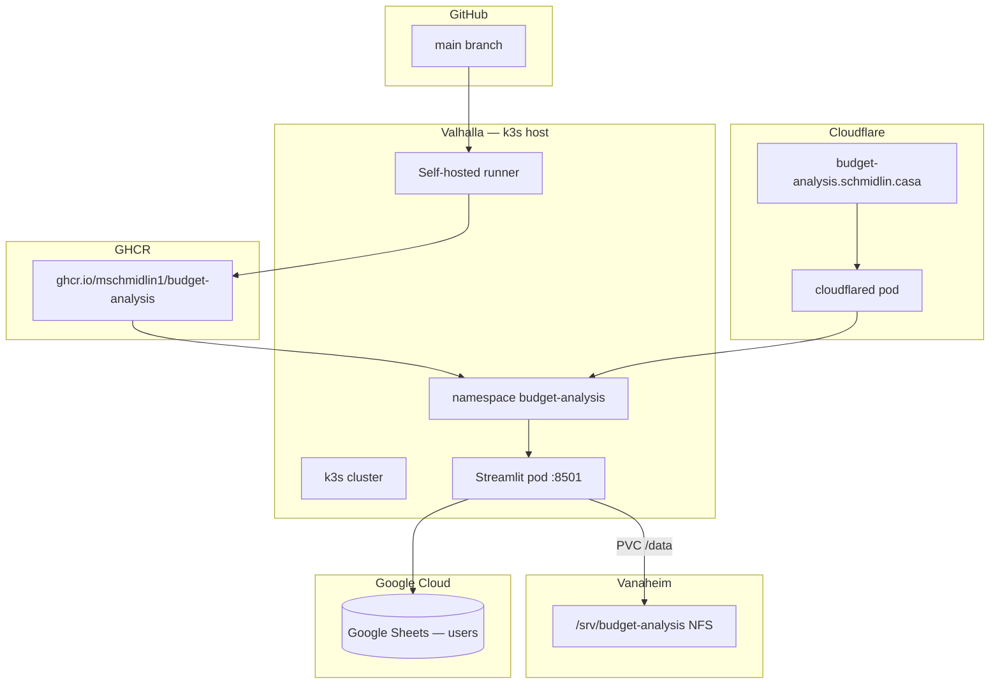

# Deployment Guide — `budget-analysis.schmidlin.casa`

This guide covers **local development** and **homelab production** for Budget Analysis: a Streamlit app backed by **Google Sheets** (users) and **filesystem storage** on NFS (configs and uploads).

Production deploys to the same stack as [Valhalla Landing Page](https://github.com/mschmidlin1/ValhallaLandingPage), [Dr. JAM](https://github.com/mschmidlin1/dr-jam), and [Resume Customizer](https://github.com/mschmidlin1/ResumeCustomizer): **self-hosted GitHub Actions runner** on **Valhalla**, **Docker** images on **GHCR**, **k3s** on Valhalla, public HTTPS via the existing **Cloudflare Tunnel** (`cloudflared`). NFS file storage lives on **Vanaheim** (see [NFS_setup.md](NFS_setup.md)).

**Target URL:** `https://budget-analysis.schmidlin.casa`

**Prerequisites (already in place from other homelab apps):**

- k3s cluster running on **Valhalla** with `kubectl` working
- `cloudflared` pod healthy in the `cloudflared` namespace
- `schmidlin.casa` **Active** in Cloudflare with SSL/TLS mode **Full**
- You can SSH to Valhalla and run `kubectl`

For background, see Valhalla docs — especially [Self-Hosting.md](https://github.com/mschmidlin1/ValhallaLandingPage/blob/main/docs/Self-Hosting.md) and [CustomDomainSetup.md](https://github.com/mschmidlin1/ValhallaLandingPage/blob/main/docs/CustomDomainSetup.md).

> **Note:** The app is currently on [Streamlit Community Cloud](https://budgetanalysis-creditcardtransactions.streamlit.app/). This guide moves it to the homelab. Keep Streamlit Cloud until homelab deploy is verified, then retire it.

---

## Summary

| Item | Value |
|------|-------|
| **Public URL** | `https://budget-analysis.schmidlin.casa` |
| **GitHub repo** | `github.com/mschmidlin1/BudgetAnalysis` |
| **Deploy trigger** | Push to `main` (or manual workflow run) |
| **GHCR image** | `ghcr.io/mschmidlin1/budget-analysis` |
| **K8s namespace** | `budget-analysis` |
| **In-cluster Service URL** | `http://budget-analysis.budget-analysis.svc.cluster.local:80` |
| **Container** | Python 3.11 + Streamlit on port **8501** |
| **App host** | **Valhalla** (k3s + runner + tunnel) |
| **Data stores** | **Google Sheets** (users) + **NFS** `/data` (configs, uploads) |

**What you add:** a new namespace, GHCR package, self-hosted runner for this repo, one Cloudflare tunnel hostname, and NFS PV/PVC (Vanaheim export).

**What you do not need:** MongoDB or a database container.

---

## Architecture



When a visitor opens `https://budget-analysis.schmidlin.casa`:

1. Cloudflare terminates HTTPS and routes through the existing tunnel to `cloudflared` on Valhalla.
2. `cloudflared` forwards to `http://budget-analysis.budget-analysis.svc.cluster.local:80`.
3. The Service (port 80 → pod 8501) routes to the Streamlit pod.
4. Streamlit reads `.streamlit/secrets.toml` (from a K8s Secret) for Google Sheets, and reads/writes user files on the NFS volume mounted at `/data`.

---

## Current status

| Item | Location | Notes |
|------|----------|-------|
| **App code** | `src/app.py`, `src/ui/`, `src/storage/`, … | Entry point is `src/app.py` |
| **Dependencies** | `requirements.txt` | Streamlit, pandas, plotly, gspread |
| **Default configs** | `src/assets/default_config.json`, `src/assets/sample_transactions.csv` | Seeded into `/data` for new users |
| **Secrets template** | `.streamlit/secrets.toml.example` | Sheets + cookie |
| **Storage** | NFS PV/PVC → `/data` | See [NFS_setup.md](NFS_setup.md) |
| **GitHub repo** | `github.com/mschmidlin1/BudgetAnalysis` | Synced with local |
| **Streamlit Cloud** | `budgetanalysis-creditcardtransactions.streamlit.app` | Existing prod; homelab replaces this |

**Already in place:** Google Cloud project / service account for Sheets, users Sheet, NFS export on Vanaheim, and `secrets.toml` for Sheets + cookie.

### Assumptions

| Topic | Choice |
|-------|--------|
| **App / k3s host** | **Valhalla** |
| **GCP / secrets** | Reuse existing Streamlit Cloud configuration |
| **CI runner** | Self-hosted on Valhalla; `KUBECONFIG: /home/mike/.kube/config` |
| **Secrets in CI** | Single GitHub secret `SECRETS_TOML` (copy from Streamlit Cloud or local `secrets.toml`) |

---

## Phase overview

| Phase | What | Where |
|-------|------|-------|
| **1** | Docker files + local run | This repo |
| **2** | Kubernetes manifests | This repo |
| **3** | Self-hosted runner | Valhalla |
| **4** | GitHub Actions deploy workflow | This repo |
| **5** | GitHub permissions + secrets | GitHub |
| **6** | First deploy + verify | CI → Valhalla |
| **7** | Cloudflare tunnel hostname | Cloudflare |
| **8** | Public URL verification | Browser / CLI |

Phases 1–4 can land on a feature branch and merge to `main`. The workflow only runs after it exists on `main`.

---

## Phase 1 — Local development and Docker

No database container — just `secrets.toml`, Streamlit, and a local `./data` directory (or NFS in production).

### 1.1 Run directly (simplest)

```bash
cd ~/source/BudgetAnalysis
source .venv/bin/activate
mkdir -p data
export BUDGET_STORAGE_ROOT="$(pwd)/data"
export PYTHONPATH=src
streamlit run src/app.py
```

Open `http://localhost:8501`. Confirm login, registration, CSV upload, and the sunburst chart work.

### 1.1.1 Plaid / Robinhood secrets

Robinhood imports require a `[plaid]` section in `.streamlit/secrets.toml`:

```toml
[plaid]
client_id = "<from-plaid-dashboard>"
secret = "<secret-for-the-selected-environment>"
env = "sandbox" # sandbox | production (Trial uses production)
token_encryption_key = "<fernet-key>"
# Optional; must exactly match a Plaid Allowed redirect URI.
# redirect_uri = "https://budget-analysis.schmidlin.casa/"
```

Generate `token_encryption_key` once and keep the same key for as long as
encrypted user tokens exist:

```powershell
.\.venv\Scripts\python.exe -c "from cryptography.fernet import Fernet; print(Fernet.generate_key().decode())"
```

Changing or losing this key makes stored Plaid access tokens unreadable; users
must then reconnect. Never commit the real values. For production, include this
whole section in the existing GitHub `SECRETS_TOML` secret.

### 1.2 Docker files

Add these three files at the repo root. The same image is used locally and in production.

**`Dockerfile`**

```dockerfile
FROM python:3.11-bookworm

WORKDIR /app
RUN mkdir -p /app/.streamlit

COPY requirements.txt .
RUN pip install --no-cache-dir -r requirements.txt

COPY src ./src

ENV PYTHONPATH=/app/src

EXPOSE 8501
CMD ["streamlit", "run", "src/app.py", "--server.address=0.0.0.0", "--server.port=8501"]
```

**`.dockerignore`**

```gitignore
.git
.venv
__pycache__
**/__pycache__
*.py[cod]
.streamlit/secrets.toml
notebooks
uploaded_files
configs
credentials.yaml
credit-card-analysis-*.json
.env
.env.*
```

**`docker-compose.yml`**

```yaml
services:
  app:
    build: .
    ports:
      - "8501:8501"
    volumes:
      - ./.streamlit/secrets.toml:/app/.streamlit/secrets.toml:ro
      - ./data:/data
```

Sheets credentials come from the mounted `secrets.toml`. File storage uses `/data` (bind-mounted from `./data` locally).

### 1.3 Run in Docker

From the repo root (WSL or Linux):

```bash
docker compose up --build
```

Open `http://localhost:8501`.

> **WSL tip:** If `docker compose build` fails with a `credsStore: desktop.exe` error, clear WSL's `~/.docker/config.json` to `{}` (leftover from Docker Desktop).

---

## Phase 2 — Kubernetes manifests

Create `k8s/` with namespace, PV/PVC, deployment, and service. Do **not** add `cloudflared` — the tunnel is shared cluster infrastructure. NFS must already be working (see [NFS_setup.md](NFS_setup.md)).

Kustomize resources: `namespace.yaml`, `pv.yaml`, `pvc.yaml`, `deployment.yaml`, `service.yaml`.

- **PV/PVC:** NFS `vanaheim.lan:/srv/budget-analysis` → claim `budget-analysis-data`
- **Deployment:** mounts secrets at `/app/.streamlit/secrets.toml` and the PVC at `/data`

### 2.1 `k8s/namespace.yaml`

```yaml
apiVersion: v1
kind: Namespace
metadata:
  name: budget-analysis
```

### 2.2 `k8s/pv.yaml` / `k8s/pvc.yaml`

See the repo files (NFS `vanaheim.lan:/srv/budget-analysis`, claim `budget-analysis-data`, `storageClassName: budget-analysis-nfs`).

### 2.3 `k8s/deployment.yaml`

Mounts secrets and the NFS PVC:

```yaml
          volumeMounts:
            - name: streamlit-secrets
              mountPath: /app/.streamlit/secrets.toml
              subPath: secrets.toml
              readOnly: true
            - name: budget-analysis-data
              mountPath: /data
      volumes:
        - name: streamlit-secrets
          secret:
            secretName: budget-analysis-secrets
            items:
              - key: secrets.toml
                path: secrets.toml
        - name: budget-analysis-data
          persistentVolumeClaim:
            claimName: budget-analysis-data
```

(Full probe/resource settings are in `k8s/deployment.yaml`.)

### 2.4 `k8s/service.yaml`

```yaml
apiVersion: v1
kind: Service
metadata:
  name: budget-analysis
  namespace: budget-analysis
spec:
  type: ClusterIP
  selector:
    app: budget-analysis
  ports:
    - port: 80
      targetPort: 8501
```

### 2.5 `k8s/kustomization.yaml`

```yaml
apiVersion: kustomize.config.k8s.io/v1beta1
kind: Kustomization

resources:
  - namespace.yaml
  - pv.yaml
  - pvc.yaml
  - deployment.yaml
  - service.yaml
```

### 2.6 Apply once manually (optional)

```bash
kubectl apply -k k8s/
kubectl get all,pv,pvc -n budget-analysis
```

`ImagePullBackOff` or `CreateContainerConfigError` before the first CI run is expected. PVC should be `Bound` if NFS is healthy.

---

## Phase 3 — Self-hosted GitHub Actions runner on Valhalla

Runners are **per repository**. Register a new one even if Valhalla already has runners for other repos.

1. [github.com/mschmidlin1/BudgetAnalysis/settings/actions/runners](https://github.com/mschmidlin1/BudgetAnalysis/settings/actions/runners) → **New self-hosted runner** → **Linux** → **x64**.
2. On Valhalla:

   ```bash
   mkdir -p ~/actions-runner-budget-analysis && cd ~/actions-runner-budget-analysis
   ```

3. Run GitHub's **Configure** commands exactly (download, extract, `./config.sh`).
4. Accept defaults at prompts, then:

   ```bash
   sudo ./svc.sh install
   sudo ./svc.sh start
   sudo ./svc.sh status
   ```

5. Confirm runner shows **Idle** or **Active** in GitHub settings.

Runner user needs `docker` group membership and `~/.kube/config` (see [Valhalla KubernetesSetup.md §1.3](https://github.com/mschmidlin1/ValhallaLandingPage/blob/main/docs/KubernetesSetup.md)).

---

## Phase 4 — GitHub Actions deploy workflow

Create `.github/workflows/deploy.yml`:

```yaml
name: Deploy

on:
  push:
    branches:
      - main
  workflow_dispatch:

permissions:
  contents: read
  packages: write

jobs:
  deploy:
    runs-on: self-hosted

    env:
      KUBECONFIG: /home/mike/.kube/config

    steps:
      - name: Checkout
        uses: actions/checkout@v4

      - name: Log in to GHCR
        run: echo "${{ secrets.GITHUB_TOKEN }}" | docker login ghcr.io -u "${{ github.actor }}" --password-stdin

      - name: Build and push image
        run: |
          IMAGE=ghcr.io/mschmidlin1/budget-analysis
          docker build -t "${IMAGE}:${{ github.sha }}" -t "${IMAGE}:latest" .
          docker push "${IMAGE}:${{ github.sha }}"
          docker push "${IMAGE}:latest"

      - name: Apply Kubernetes manifests
        run: kubectl apply -k k8s/

      - name: Apply Kubernetes Secret
        env:
          SECRETS_TOML: ${{ secrets.SECRETS_TOML }}
        run: |
          kubectl -n budget-analysis create secret generic budget-analysis-secrets \
            --from-literal=secrets.toml="$SECRETS_TOML" \
            --dry-run=client -o yaml | kubectl apply -f -

      - name: Roll out new image
        run: |
          kubectl set image deployment/budget-analysis \
            app=ghcr.io/mschmidlin1/budget-analysis:${{ github.sha }} \
            -n budget-analysis
          kubectl rollout status deployment/budget-analysis \
            -n budget-analysis \
            --timeout=5m
```

The workflow sets `KUBECONFIG` explicitly because the runner service does not load `~/.bashrc` — see [Valhalla Self-Hosting.md — KUBECONFIG gotcha](https://github.com/mschmidlin1/ValhallaLandingPage/blob/main/docs/Self-Hosting.md#common-gotcha-kubeconfig-in-ci).

---

## Phase 5 — GitHub repository settings

### 5.1 Actions permissions

1. [Settings → Actions](https://github.com/mschmidlin1/BudgetAnalysis/settings/actions) → Actions enabled.
2. **Workflow permissions** → **Read and write permissions** (for GHCR push).

### 5.2 Repository secret

Copy your existing Streamlit Cloud secrets (or local `.streamlit/secrets.toml`) into a GitHub Actions secret:

| Secret | Value |
|--------|-------|
| `SECRETS_TOML` | Full contents of production `secrets.toml` |

From Streamlit Cloud: app → **Settings → Secrets** → copy all sections.

From a local file:

```powershell
Get-Content .streamlit\secrets.toml -Raw | Set-Clipboard
```

### 5.3 GHCR visibility (after first deploy)

Packages → `budget-analysis` → **Package settings** → **Public** (so k3s can pull without `imagePullSecrets`).

---

## Phase 6 — First deploy and verify

1. Commit Phases 1, 2, and 4; push to **`main`**.
2. Watch [Actions → Deploy](https://github.com/mschmidlin1/BudgetAnalysis/actions).
3. On Valhalla:

   ```bash
   kubectl get pods -n budget-analysis
   ```

   Expected: `Running`, `1/1`.

4. In-cluster health check:

   ```bash
   kubectl run curl-test --rm -it --restart=Never --image=curlimages/curl -- \
     curl -s -o /dev/null -w "HTTP %{http_code}\n" \
     http://budget-analysis.budget-analysis.svc.cluster.local:80/_stcore/health
   ```

   Expected: `HTTP 200`.

5. Check logs if GCP calls fail:

   ```bash
   kubectl logs -n budget-analysis deploy/budget-analysis --tail=50
   ```

---

## Phase 7 — Cloudflare Tunnel route

Add a **Public Hostname** on the **existing** homelab tunnel (do not create a second tunnel).

1. [Cloudflare Zero Trust](https://one.dash.cloudflare.com/) → **Networks** → **Tunnels** → your tunnel → **Public Hostname** → **Add**.

| Field | Value |
|-------|-------|
| **Subdomain** | `budget-analysis` |
| **Domain** | `schmidlin.casa` |
| **Path** | *(empty)* |
| **Type** | `HTTP` |
| **URL** | `http://budget-analysis.budget-analysis.svc.cluster.local:80` |

2. Confirm DNS record **`budget-analysis`** (proxied) exists under `schmidlin.casa`.

---

## Phase 8 — Verify the public URL

```bash
curl -I https://budget-analysis.schmidlin.casa
```

Expected: `HTTP/2 200` with a valid cert.

Open **`https://budget-analysis.schmidlin.casa`** and confirm login, registration, CSV upload, and visualization.

### Retire Streamlit Cloud (optional)

1. [share.streamlit.io](https://share.streamlit.io/) → delete or pause the app.
2. Update `README.md` to point at `https://budget-analysis.schmidlin.casa`.

### Link from Valhalla (optional)

Add `url: "https://budget-analysis.schmidlin.casa"` to [Valhalla `links.js`](https://github.com/mschmidlin1/ValhallaLandingPage/blob/main/src/js/links.js).

---

## Local development vs production

| | Local | Production |
|---|-------|------------|
| **Run** | `PYTHONPATH=src streamlit run src/app.py` or `docker compose up --build` | k8s pod on Valhalla |
| **URL** | `http://localhost:8501` | `https://budget-analysis.schmidlin.casa` |
| **Secrets** | `.streamlit/secrets.toml` on disk | K8s Secret mounted in pod |
| **File storage** | `./data` or `BUDGET_STORAGE_ROOT` | NFS PVC at `/data` |
| **Updates** | Save → refresh | Push to `main` |

---

## Day-to-day operations

| Task | How |
|------|-----|
| Deploy | Push to **`main`** |
| Watch deploy | [Actions → Deploy](https://github.com/mschmidlin1/BudgetAnalysis/actions) |
| Pod health | `kubectl get pods -n budget-analysis` |
| Logs | `kubectl logs -n budget-analysis deploy/budget-analysis -f` |
| Roll back | `kubectl rollout undo deployment/budget-analysis -n budget-analysis` |
| Update secrets | Change `SECRETS_TOML`, re-run **Deploy** |

---

## Troubleshooting

### NFS / filesystem storage errors

| Symptom | Fix |
|---------|-----|
| Pod `FailedMount` | Confirm NFS export, firewall, and `vanaheim.lan` DNS (see [NFS_setup.md](NFS_setup.md)) |
| Permission denied writing `/data` | Export flags / ownership on Vanaheim (`no_root_squash` for root containers) |
| Empty user data after cutover | GCS → NFS migration not run yet — see [migrate_gcs_to_nfs.md](migrate_gcs_to_nfs.md) |
| PVC Pending | PV/PVC `storageClassName` and `volumeName` must match |

### Google Sheets errors

| Symptom | Fix |
|---------|-----|
| Permission denied | Share Sheet with service account as Editor |
| Sheet not found | Check `[connections.gsheets] spreadsheet` URL |
| API disabled | Enable Google Sheets API |
| Missing tab | Worksheet must be named `users` |

### Deploy / k8s

| Symptom | Fix |
|---------|-----|
| Workflow missing | File must be on `main` |
| Runner idle | [Check runners](https://github.com/mschmidlin1/BudgetAnalysis/settings/actions/runners) |
| `ImagePullBackOff` | GHCR package public; tag exists |
| KUBECONFIG error | Workflow needs `KUBECONFIG: /home/mike/.kube/config` |
| Tunnel 502 | `kubectl get pods -n cloudflared` |
| Wrong site | Tunnel URL must be `http://budget-analysis.budget-analysis.svc.cluster.local:80` |
| DNS NXDOMAIN | Check Cloudflare for `budget-analysis` record |

Test outbound HTTPS from a pod:

```bash
kubectl run net-test --rm -it --restart=Never --image=curlimages/curl -- \
  curl -s -o /dev/null -w "HTTP %{http_code}\n" https://www.googleapis.com
```

---

## Completion checklist

- [ ] `SECRETS_TOML` set (Sheets + cookie; `[gcs]` no longer required)
- [ ] `Dockerfile`, `.dockerignore`, `docker-compose.yml` committed
- [ ] `k8s/` manifests committed (including `pv.yaml` / `pvc.yaml`)
- [ ] NFS export on Vanaheim verified ([NFS_setup.md](NFS_setup.md))
- [ ] Self-hosted runner on Valhalla (Idle/Active)
- [ ] `.github/workflows/deploy.yml` on `main`
- [ ] GitHub secret `SECRETS_TOML` set; GHCR package public
- [ ] Deploy workflow green; pod `Running 1/1` with `/data` mounted
- [ ] Cloudflare hostname `budget-analysis.schmidlin.casa` → in-cluster Service
- [ ] `curl -I https://budget-analysis.schmidlin.casa` → 200
- [ ] Browser smoke test passes
- [ ] *(Optional)* GCS → NFS data migration completed ([migrate_gcs_to_nfs.md](migrate_gcs_to_nfs.md))
- [ ] *(Optional)* Streamlit Cloud retired; Valhalla link added

---

## See also

- [migrate_gcs_to_nfs.md](migrate_gcs_to_nfs.md) — GCS → NFS data migration (probe + manual fallback)
- [NFS_setup.md](NFS_setup.md) — NFS export and k8s mount
- [Resume Customizer deployment.md](https://github.com/mschmidlin1/ResumeCustomizer/blob/main/docs/deployment.md)
- [Dr. JAM Deployment.md](https://github.com/mschmidlin1/dr-jam/blob/main/docs/Deployment.md)
- [Valhalla Self-Hosting.md](https://github.com/mschmidlin1/ValhallaLandingPage/blob/main/docs/Self-Hosting.md)
- [Streamlit GSheets connection](https://github.com/streamlit/gsheets-connection)
