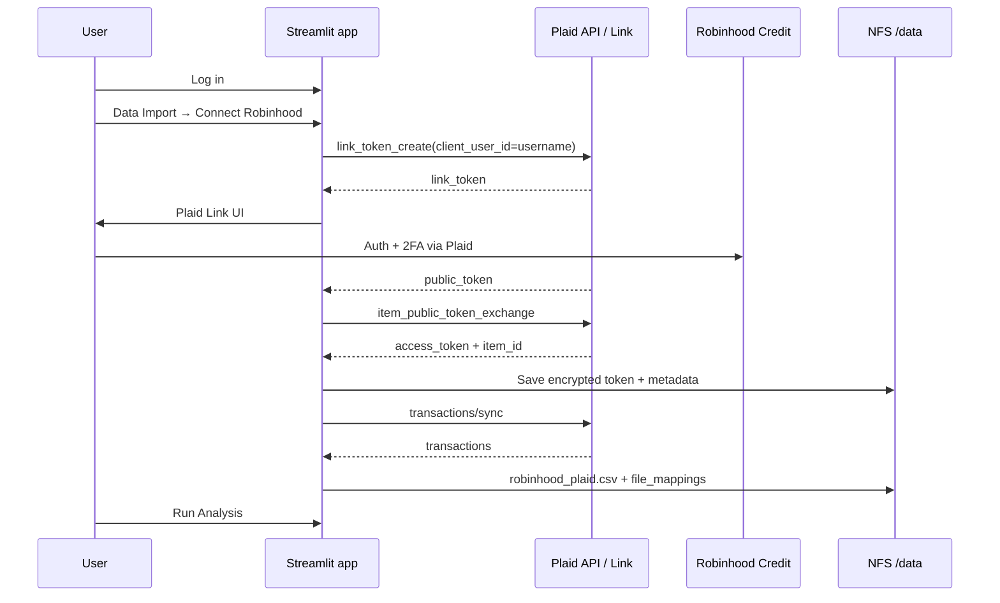

# Robinhood Gold Card Import via Plaid — Implementation Plan

> **Historical note (2026-07):** This plan guided the initial Robinhood-focused
> build. The shipped feature is **institution-agnostic** Plaid import: CSV names
> are `{institution_slug}_plaid.csv`, `Source` is the institution display name,
> and connect/sync/disconnect live in `plaid_service.py` / `plaid_ui.py`. For
> current setup, see [README.md](../README.md) and [deployment.md](deployment.md).

**Original goal:** Let authenticated users connect their Robinhood Gold Card through Plaid and import transactions into Budget Analysis (Robinhood does not offer a CSV export).

**How to use this doc**

1. Complete **Part 1 (you)** end-to-end and fill in the handoff checklist.
2. Paste the handoff values into chat and tell the agent to implement **Part 2**.
3. Expect a short **Part 3** verification pass after the code lands (real Robinhood link / amount signs). That is the only planned back-and-forth.

---

## Why this exists

Robinhood supports budgeting apps via Plaid for Gold Card / Robinhood Credit, but has no user CSV download. This app is CSV-only today. Plaid Link is the import path.

---

## Locked design decisions (so the agent does not ask)

| Topic | Decision |
|-------|----------|
| Where Link UI lives | Data Import tab (`data_import_tab.py`), not login |
| User id for Plaid | Existing `st.session_state.username` |
| Where transactions land | `{username}/uploads/{institution_slug}_plaid.csv` with Date/Amount/Description (+ `Source` = institution name) |
| Analysis changes | Prefer none — auto-set `file_mappings` like other CSVs |
| Token storage | Encrypted file under `{username}/secrets/` (no new DB) |
| Sync trigger | Manual **Sync now** first (no webhooks yet) |
| Scope | Any supported US institution via Plaid (Robinhood Gold Card / Credit included) |
| Env to start | Sandbox for build; Trial/Production for your real card test |

---

# Part 1 — Prerequisites (you must do these)

Do these before asking the agent to implement. Nothing in Part 2 can finish without the secrets and redirect URIs below.

## 1.1 Create a Plaid developer account

1. Sign up: [https://dashboard.plaid.com/signup](https://dashboard.plaid.com/signup)
2. Create an application named something like **Budget Analysis**
3. Open **Team Settings → Keys** and copy:
   - `client_id`
   - **Sandbox** `secret` (use Sandbox first)
4. Enable the **Transactions** product for the app
5. Skim pricing so you know Sandbox is free and live envs may bill later

## 1.2 Configure Allowed Redirect URIs

In the Plaid dashboard (Team Settings → API / Allowed redirect URIs), add:

| Environment | URI |
|-------------|-----|
| Local | `http://localhost:8501/` |
| Homelab prod | `https://budget-analysis.schmidlin.casa/` |
| Legacy Streamlit Cloud (if still used) | your current `*.streamlit.app` URL |

OAuth/Link will fail on hosted/mobile flows if these are missing or wrong.

## 1.3 Generate a token encryption key

The agent will encrypt Plaid `access_token`s on disk. Generate a key locally (do not commit it):

```bash
python -c "from cryptography.fernet import Fernet; print(Fernet.generate_key().decode())"
```

If `cryptography` is not installed in your venv yet, either activate `.venv` and `pip install cryptography`, or use any Fernet-capable one-liner you prefer. Save the output for the handoff checklist.

## 1.4 Put secrets in local `.streamlit/secrets.toml`

Add (or merge) this block into your **local** gitignored secrets file. Do **not** commit real values.

```toml
[plaid]
client_id = "<from-dashboard>"
secret = "<sandbox-secret>"
# sandbox | development | production
env = "sandbox"
token_encryption_key = "<fernet-key-from-step-1.3>"
```

Keep existing `[connections.gsheets]` and `[cookie]` sections as they are.

## 1.5 Optional now, required before real Robinhood data

You can defer this until Sandbox sync works in the app:

1. Activate Plaid's free **Trial plan** (new US/Canada personal-use teams)
2. Copy the **Production** secret; Trial uses real Production data with a
   10-Production-Item lifetime creation limit
3. Confirm Robinhood Credit / Gold Card is linkable in Production Link
4. When ready for the live test, set `env = "production"` and swap in the
   Production secret — locally first, then in deploy secrets

## 1.6 Homelab deploy secrets (can wait until local works)

When you want this on `budget-analysis.schmidlin.casa`, update the same `[plaid]` block in whatever feeds the K8s Secret (`SECRETS_TOML` / GitHub secret used by deploy). The agent will document the exact shape; you must paste the real values into the secret store.

## 1.7 Handoff checklist — paste this back to the agent

Copy, fill in, and send when Part 1 is done:

```text
Plaid handoff for BudgetAnalysis:

- [ ] Plaid app created: Budget Analysis (or name: ________)
- [ ] Transactions product enabled: yes
- [ ] client_id: ________
- [ ] sandbox secret: ________
- [ ] token_encryption_key: ________
- [ ] secrets.toml updated locally with [plaid] block: yes
- [ ] Redirect URIs added:
      - http://localhost:8501/
      - https://budget-analysis.schmidlin.casa/
      - (optional Streamlit Cloud) ________
- [ ] Start implementation against: sandbox
- [ ] Also activate Trial/Production now? (yes/no) ________
- [ ] Production secret already placed in secrets.toml (if yes): ________
- [ ] Confirmed Robinhood appears in Link/dashboard? (yes/no/unsure) ________
- [ ] Update K8s/deploy secrets in this pass? (yes/no — default no until local works)

Please implement Part 2 of docs/robinhood_plan.md.
```

**Security:** Prefer pasting secrets into a local secrets file yourself and telling the agent “`[plaid]` is already in `.streamlit/secrets.toml`” rather than putting secrets in chat. If you do paste them in chat, rotate them afterward if the chat is retained anywhere you do not trust.

---

# Part 2 — Agent implementation (after handoff)

Assumes Part 1 secrets exist locally. Agent should not invent fake Plaid credentials.

## 2.1 Context the agent should respect

| Area | Today | Implication |
|------|--------|-------------|
| Stack | Multi-user Streamlit (`main.py`) | Embed Link in Data Import |
| Auth | Sheets + streamlit-authenticator | `username` = Plaid `client_user_id` |
| Storage | NFS/filesystem under `BUDGET_STORAGE_ROOT` | No new database |
| Secrets | `.streamlit/secrets.toml` → K8s Secret | Extend example + deploy docs |
| Analysis | `combine_transaction_files` | Feed a normal CSV + mappings |

Touchpoints: `data_import_tab.py`, `upload_tools.py`, `storage_utils.py`, `analysis_utils.py`, `user_tools.py`, `.streamlit/secrets.toml.example`, `docs/deployment.md`, `requirements.txt`, `tests/`.

## 2.2 Target user flow



## 2.3 Storage layout

```
{BUDGET_STORAGE_ROOT}/{username}/
  uploads/
    robinhood_plaid.csv
  configs/
    {username}_upload_config.json
    {username}_plaid.json
  secrets/
    plaid_access_token.enc
```

`{username}_plaid.json` metadata (no raw access token):

```json
{
  "item_id": "...",
  "institution_name": "Robinhood",
  "linked_at": "2026-07-19T12:00:00Z",
  "last_sync_at": null,
  "cursor": null
}
```

Use `/transactions/sync` and persist `cursor`.

## 2.4 Security requirements

- Never store permanent `access_token` only in `st.session_state`
- Encrypt token at rest with `st.secrets["plaid"]["token_encryption_key"]`
- Never log tokens or full Link payloads
- Per-user isolation; disconnect removes local token/metadata and removes Item via Plaid when possible
- Redirect URIs must match Part 1

## 2.5 Dependencies

```bash
pip install plaid-python cryptography
```

Plaid Link uses the official Plaid JavaScript SDK through the small in-repo
`plaid_link_component.py` component. There is no maintained
`streamlit-plaid-link` package to depend on.

## 2.6 Implementation checklist (agent)

### A. Secrets and docs scaffolding

- [x] Add `[plaid]` placeholders to `.streamlit/secrets.toml.example`
- [x] Document Plaid secrets in `docs/deployment.md` (shape only, no real keys)
- [x] Add deps to `requirements.txt` / install in `.venv` for tests

### B. Plaid client + token persistence

- [x] `plaid_service.py`: client from secrets + env host mapping
- [x] Encrypt/decrypt helpers; paths under `{username}/secrets/` and `{username}/configs/`
- [x] Unit tests for crypto + path helpers (no live Plaid calls)

### C. Link + connect/disconnect UI

- [x] Data Import section: Connect / status / Disconnect
- [x] `link_token_create` with products=`transactions`, `client_user_id=username`
- [x] Exchange `public_token` → save encrypted `access_token` + `item_id`
- [x] Handle Link failures with user-visible errors

### D. Sync → CSV pipeline

- [x] `/transactions/sync` with stored cursor
- [x] Normalize to Date / Amount / Description / Source=`{institution}`
- [x] Exclude pending txs initially
- [x] Write `{institution_slug}_plaid.csv`; set `file_mappings`
- [x] **Sync now** + last-sync timestamp
- [x] Keep Plaid Amount signs (positive = purchase); covered by unit test — confirm with Sandbox/live data if charts look wrong

### E. UX / help polish

- [x] Short help text: credentials go to Plaid/Robinhood, not this app
- [x] Update `info_tab.py` and README features when behavior is real
- [x] ITEM_LOGIN_REQUIRED → prompt re-Link (update mode)

### F. Deploy path (only if handoff says yes)

- [x] Ensure K8s/secret docs mention `[plaid]` keys
- [x] Do not invent production secrets; only wire structure

## 2.7 Reference sketch (agent should turn into real modules)

```python
# Illustrative — production code in plaid_client.py + data_import_tab helpers
configuration = plaid.Configuration(
    host=plaid.Environment.Sandbox,  # from st.secrets["plaid"]["env"]
    api_key={
        "clientId": st.secrets["plaid"]["client_id"],
        "secret": st.secrets["plaid"]["secret"],
    },
)
client = plaid_api.PlaidApi(plaid.ApiClient(configuration))

link_request = LinkTokenCreateRequest(
    products=[Products("transactions")],
    client_name="Budget Analysis",
    country_codes=[CountryCode("US")],
    language="en",
    user=LinkTokenCreateRequestUser(client_user_id=current_user),
)
link_token = client.link_token_create(link_request)["link_token"]
public_token = streamlit_plaid_link(link_token=link_token, ...)
# exchange → encrypt → sync → CSV
```

## 2.8 Transaction field mapping

| App column | Plaid field | Notes |
|------------|-------------|--------|
| Date | `date` | Prefer posted date |
| Amount | `amount` | Verify sign vs app heuristics |
| Description | `merchant_name` or `name` | Prefer merchant_name |
| Source | `"Robinhood"` | Constant |

## 2.9 Out of scope for Part 2

- Replacing CSV upload entirely
- Webhooks / background auto-sync
- Google Sheets transaction storage
- Plaid Investments / brokerage holdings
- Custom Robinhood scraping

## 2.10 Success criteria for agent handoff complete

1. Logged-in user can open Plaid Link from Data Import (Sandbox)
2. Tokens persist across Streamlit restart, per username, encrypted
3. Sync produces a CSV Main analysis can chart
4. Disconnect + re-link works
5. Example secrets + deploy docs updated
6. Unit tests cover crypto/path helpers and pass in `.venv`

---

# Part 3 — Short back-and-forth (expected after code)

These cannot be fully closed by the agent alone:

| Step | Who | What |
|------|-----|------|
| Sandbox Link smoke test | You | Click Connect, use Sandbox test credentials, confirm CSV + analysis |
| Real Robinhood link | You | Activate Trial, switch to Production secret, link Gold Card, report amount/date quirks |
| Sign / pending tweaks | Agent | Adjust normalization if your real data looks wrong |
| Paid Production upgrade | You | Only if you outgrow the free Trial limits |
| Homelab secret inject | You | Paste `[plaid]` into deploy `SECRETS_TOML` / K8s secret when ready to ship |

---

## Risks (awareness only)

1. Robinhood Credit must be Link-eligible in your Plaid env
2. Redirect URI mismatch breaks OAuth on hosted/mobile
3. The in-repo Streamlit component must be smoke-tested with Plaid Link
4. Amount signs can skew charts if wrong
5. Live Transactions may cost money outside Sandbox

---

## Your next action

Complete **Part 1**, fill **§1.7 Handoff checklist**, then ask the agent to implement **Part 2**.
